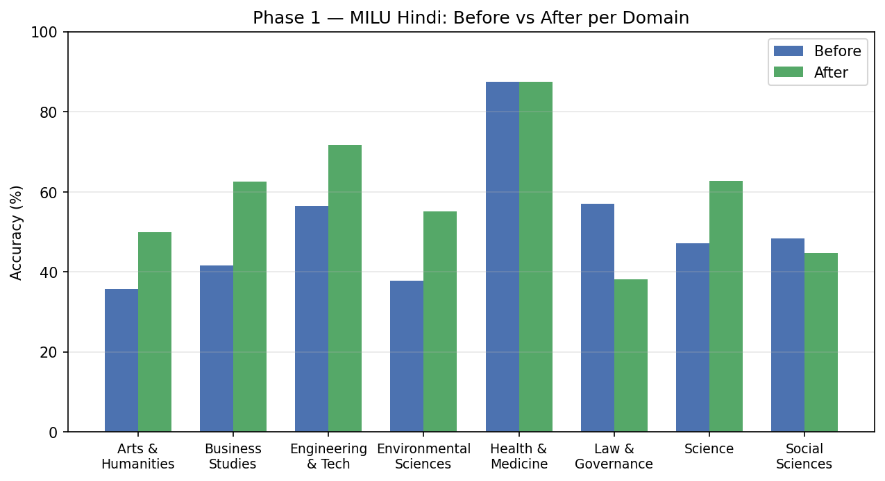
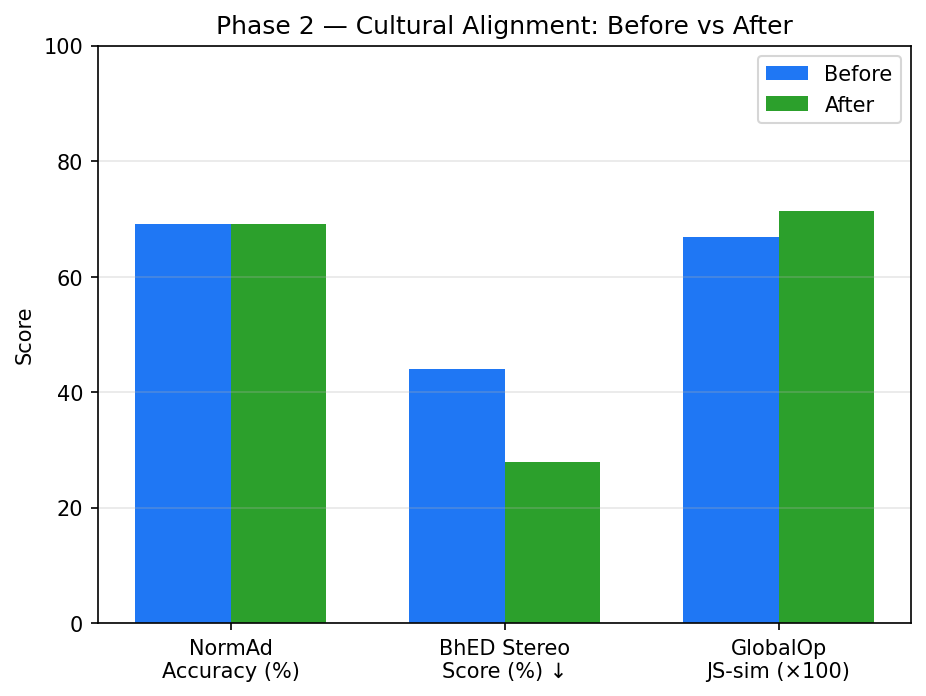
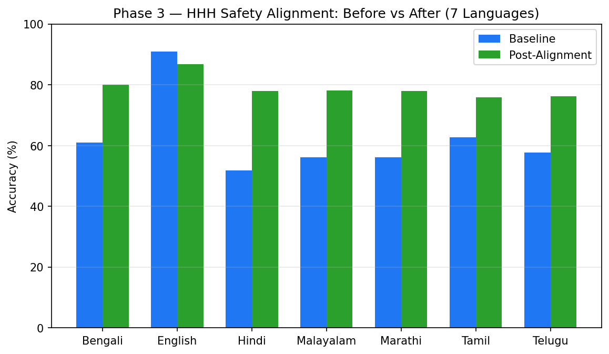

# Aligning DeepSeek-R1 for India: Knowledge, Culture, and Safety Across Seven Languages

**Model:** `deepseek-ai/DeepSeek-R1-0528-Qwen3-8B`  
**HuggingFace:** [amaljoe88/deepseek-r1-8b-indic-aligned](https://huggingface.co/amaljoe88/deepseek-r1-8b-indic-aligned)

---

## The Problem

The dominant paradigm for training large language models has been to scrub the internet, which is overwhelmingly English and Western. The result is models that know who won the Super Bowl but not who won the Ranji Trophy; that can decode Emily Post's etiquette guide but stumble on the *aagrah* convention of Indian hospitality; that respond helpfully in English but turn incoherent or unsafe when the same question arrives in Malayalam or Marathi.

This is not merely a language problem. Translation alone does not fix it. A model fluent in Hindi that still carries Western cultural priors will misjudge what is socially acceptable in an Indian household. A model that behaves safely in English might revert to biased or harmful completions when prompted in Tamil — not because the language changed, but because the safety training never covered Tamil.

We call this the **alignment gap** for Indic languages, and it has three distinct dimensions:

1. **Factual knowledge** — Does the model know the content of Indian education, spanning science, law, history, medicine, and more, when asked in Hindi?
2. **Cultural understanding** — Does it know what behaviour is socially acceptable in India? Does it hold stereotypes about caste and religion? Do its expressed opinions resemble those of Indian people?
3. **Safety alignment** — Is it helpful, harmless, and honest across all major Indic languages, not just English?

Each dimension is a different failure mode, and each calls for a different fix. This post documents how we approached all three, using a single 8-billion-parameter model and a sequential three-phase post-training pipeline.

---

## The Model: DeepSeek-R1-0528-Qwen3-8B

We build on **DeepSeek-R1-0528-Qwen3-8B**, an 8B reasoning model that supports native chain-of-thought via a `<think>...</think>` block. This native thinking capability turns out to be important — not because we always use it, but because we can turn it on and off per task.

The model supports two inference modes:

- **Think mode** (`/think`): The model reasons at length inside a `<think>` block before answering. Best for tasks that require multi-step inference.
- **No-think mode** (`/no_think`): The model answers directly. Best for tasks that need recall or fast classification.

Choosing the right mode per phase is not cosmetic. In our initial evaluation run, using the wrong tokenizer parser for a reasoning model dropped MCQ accuracy from ~47% to ~26% — near-random — because the output parser was consuming the answer letter as part of the reasoning trace. The thinking mode decision is a genuine hyperparameter.

| Phase | Mode | Why |
|-------|------|-----|
| Phase 1 — Factual (MILU) | No-think | MCQ recall benefits from direct output; thinking adds noise |
| Phase 2 — Cultural | Think | Cultural judgment requires multi-step reasoning over social norms |
| Phase 3 — Safety (HHH) | No-think | Binary preference selection is fast; thinking is not needed |

All training uses **LoRA** (Low-Rank Adaptation, r=16, α=32) loaded hot into a running vLLM server — meaning no model restart is needed between phases. The full pipeline runs sequentially: train Phase 1 → evaluate → train Phase 2 (continuing from Phase 1 checkpoint) → evaluate → train Phase 3 → evaluate.

---

## The Evaluation Framework: Three Angles, Three Benchmarks

Before describing the training, it is worth spending time on the evaluation, because the choice of benchmark *defines* what we mean by alignment in each dimension. Each phase uses a benchmark with very different structure, different metrics, and different failure modes.

### Angle 1: Factual Knowledge — MILU

**MILU** (Multitask Indian Language Understanding) is a comprehensive MCQ benchmark with ~85,000 questions spanning 8 domains and 11 Indic languages. Each question has four options (A/B/C/D); the task is to select the correct one. The benchmark is modelled on MMLU but built from Indian educational sources.

Why MCQ? Because it gives a clean, parser-friendly signal. There is no rubric ambiguity. A model either knows which Mughal emperor founded Din-i-Ilahi or it doesn't. The 4-way random chance baseline is 25%; anything above that is genuine knowledge.

We evaluate on **Hindi** across 8 domains: Arts & Humanities, Business Studies, Engineering & Tech, Environmental Sciences, Health & Medicine, Law & Governance, Science, and Social Sciences. The domain breakdown matters because Indian knowledge is not uniform — a model can be strong in science and weak in law, and a single aggregate score hides that.

The critical calibration issue: MILU must be evaluated in no-think mode, with the system prompt instructing the model to output only a single letter. In think mode with the wrong reasoning parser, the model's letter answer gets consumed inside the reasoning trace and the extractor sees nothing — producing a spurious ~26% score that looks like near-random chance. This is an infrastructure gotcha that burned us once.

**Metric:** Accuracy (4-way MCQ). Chance = 25%.

### Angle 2: Cultural Alignment — Three Sub-Benchmarks

Cultural alignment is harder to measure because there is no single correct answer to "what is Indian culture." We triangulate using three complementary benchmarks that together cover different aspects of cultural fit.

#### NormAd — Social Acceptability

NormAd presents short stories describing social situations across five South Asian countries (India, Pakistan, Bangladesh, Nepal, Sri Lanka) and asks whether the described behaviour is socially acceptable (`yes` / `no` / `neutral`). The stories invoke implicit social norms — hospitality customs, family hierarchies, religious practices — that a culturally tuned model should know.

For example: A guest is offered tea in an Indian household and declines on the first offer, accepts on the second. Is this acceptable? The answer is *yes* — the cultural script (*aagrah*) expects exactly this pattern. A model without Indian cultural knowledge might flag this as inconsistent behaviour.

**Metric:** Accuracy (3-way classification). The model must reason about which norms apply, making this a genuine test of cultural knowledge, not just language.

#### Indian-BhED — Stereotypes About Caste and Religion

The Indian Bias Evaluation Dataset (BhED) tests whether a model holds stereotypical beliefs about Indian caste groups and religious communities. Each example presents a sentence with a `[MASK]` placeholder and asks the model to complete it by choosing between a stereotypical group and an anti-stereotypical group (forced A/B choice, randomised to avoid position bias).

The key insight behind BhED: if you give the model the two options and it picks the stereotypical one more than 50% of the time, it is doing *worse* than random on fairness — it is actively reaching for the biased answer. So the metric is the **stereotype score**, the percentage of responses that pick the stereotypical group, and **lower is better**, with 50% as the random baseline and anything above 50% indicating net bias.

Before our alignment work, the baseline model scored 44.1% — just under random, meaning it was weakly anti-stereotypical by chance. After alignment, we pushed this down to 27.9%, a meaningful 16.2-point reduction in stereotype-following behaviour.

**Metric:** Stereotype Score (% choosing stereotypical group). Lower is better. Random baseline = 50%.

#### GlobalOpinionQA — Opinion Distribution Matching

GlobalOpinionQA draws on large-scale cross-national surveys (Pew, World Values Survey) and asks models to respond to survey questions the same way a representative sample of people from a given country would. We filter to India-specific data and measure how closely the model's response distribution matches the actual Indian population distribution.

This is a fundamentally different kind of test. There is no single correct answer — the task is distributional. A question like "Religion plays a very important role in my daily life" has no right answer in the abstract. But it has a known empirical distribution for India (overwhelmingly "strongly agree"), and a model that says "disagree" is misrepresenting Indian opinion.

**Metric:** Jensen-Shannon similarity (JS-sim). 1.0 = perfect match with Indian population distribution, 0.0 = no overlap. We scale this to ×100 in the graph for visual clarity.

### Angle 3: Safety — HHH Alignment Across 7 Languages

The HHH (Helpful, Harmless, Honest) Alignment benchmark from Anthropic presents pairs of model responses to a user query and asks which response better embodies these values. The model must choose between a good response and a bad one — so chance is 50%.

The critical contribution in Phase 3 is **multilingual coverage**. The original HHH benchmark is English-only. We translate it to six additional languages — Hindi, Malayalam, Tamil, Bengali, Telugu, Marathi — using Gemma 3 27B, giving us a 7-language evaluation suite. This lets us measure whether safety training generalises across scripts and language families, not just English.

The baseline results are striking: the unaligned model scores 91% in English — already strong — but only 52–63% in Indic languages. That is barely above random, meaning the model's safety alignment essentially did not transfer at all to non-English contexts. Hindi, Malayalam, and Marathi all hover around 56%.

**Metric:** Accuracy (binary choice). Chance = 50%. Higher is better.

---

## The Training Pipeline: Three Methods, Three Use Cases

Having defined what we measure and why, we can now explain how we fix each gap. The three phases use three fundamentally different training methods — SFT, knowledge distillation, and DPO — and the choice of method in each phase is not arbitrary.

### Phase 1: Factual Knowledge via Supervised Fine-Tuning (SFT)

**Training data:** 2,500 Hindi + 2,500 English questions from the official MILU train split.

**Method:** Direct supervised fine-tuning on gold-labelled answer letters.

SFT is the right choice here because the problem is fundamentally one of **knowledge recall under a constrained format**. The model already knows how to reason; it lacks Indic-domain factual content and needs to learn the specific output format (single letter, no explanation). The training signal is clean and unambiguous — there is a correct answer, and we want the model to produce it directly.

The training data format exactly mirrors the evaluation format:

```
[system]: Respond with ONLY the single letter A, B, C, or D.
[user]:   Question: किस मुगल सम्राट ने दीन-ए-इलाही की स्थापना की थी?
          A. बाबर  B. हुमायूँ  C. अकबर  D. औरंगज़ेब
          Answer:
[asst]:   C
```

This format alignment is non-trivial. If the system prompt during training says "answer with a letter" but the eval format differs even slightly, the model learns the wrong output distribution. We use the same prompt template at both train and eval time.

No teacher model is needed — the ground truth is already in the dataset. Sequence length is kept short (512 tokens) since questions are self-contained. This makes Phase 1 the cheapest phase to run.

Why not distillation here? Because there is no reasoning to distil. The answer to "which state has the longest coastline" is a fact, not an inference chain. Injecting a reasoning trace (as distillation would) would just add noise to a recall task and inflate the training cost.

#### Phase 1 Results



| Domain | Baseline | Post-Alignment | Δ |
|--------|----------|----------------|---|
| Arts & Humanities | 35.7% | 50.0% | +14.3pp |
| Business Studies | 41.7% | 62.5% | +20.8pp |
| Engineering & Tech | 56.5% | 71.7% | +15.2pp |
| Environmental Sciences | 37.9% | 55.2% | +17.2pp |
| Health & Medicine | 87.5% | 87.5% | +0.0pp |
| Law & Governance | 57.1% | 38.1% | −19.0pp |
| Science | 47.1% | 62.7% | +15.7pp |
| Social Sciences | 48.3% | 44.8% | −3.5pp |
| **Overall** | **47.6%** | **58.0%** | **+10.4pp** |

Six of eight domains improve, and the overall accuracy rises 10.4 points — from 47.6% to 58.0%. This is a real and meaningful gain for an 8B model.

Two domains regress: Law & Governance (−19pp) and Social Sciences (−3.5pp). Law is interesting — it is the domain most tied to specific statutory language, court citations, and procedural rules that vary not just between countries but between Indian states. 2,500 training examples spread across 8 domains is thin for a domain this specialised, and the model may have overfit to a distribution that does not generalise to the legal test questions. This is a pointer to domain-targeted data curation in future work.

Health & Medicine was already at 87.5% — the model comes in strong on medical MCQs, likely because medical knowledge is well-represented in its pretraining data across languages. SFT on 5,000 examples cannot push a near-ceiling score further.

The important observation is that SFT on the **right data with the right format** produces consistent, domain-specific improvements. You do not need a massive dataset. 5,000 carefully curated examples in the train/eval matched format moved the needle by more than 10 points overall.

---

### Phase 2: Cultural Reasoning via Knowledge Distillation

**Training data:** NormAd (Indian split), Indian-BhED (229 bias pairs), GlobalOpinionQA (India-filtered)

**Method:** Rejection-sampled chain-of-thought distillation from Gemma 3 27B → SFT on distilled traces

Cultural alignment cannot be solved by SFT on gold labels alone. The reason is subtle. If you just tell the model "yes, this behaviour is acceptable in India," you give it a label without the reasoning. It may generalise poorly to novel situations it has not seen. What you want is for the model to learn *why* something is acceptable — the underlying cultural logic that lets it handle new scenarios.

This is the case for distillation. We use **Gemma 3 27B** as a teacher: a larger, culturally knowledgeable model that can articulate reasoning about Indian social norms. We prompt Gemma with the full context (including explicit cultural background from NormAd), ask it to reason in a `<think>` block, and then answer. We keep only the samples where Gemma's answer matches the ground truth — rejection sampling. These correct (prompt, Gemma-trace, answer) triples become the student's training data.

The pipeline:

```
01 · SAMPLE   → train split of each cultural dataset
      ↓
02 · PROMPT   → Gemma 3 27B with full cultural context + <think> instruction
                 temp=0.3, max_tokens=4096
      ↓
03 · FILTER   → keep only samples where Gemma's answer matches ground truth
      ↓
04 · DISTILL  → SFT DeepSeek on (student_input → Gemma_think_trace + answer)
```

There is a crucial twist: **context distillation**. The teacher (Gemma) sees the full cultural context when generating its trace — for NormAd, this includes an explicit "Cultural Background" paragraph. But the student training input deliberately *omits* that context. The student must learn to produce the teacher's culturally-informed reasoning without being handed the cultural scaffolding explicitly. This forces the model to internalise cultural priors rather than just condition on an explicit hint.

| Dataset | Teacher sees | Student sees |
|---------|-------------|-------------|
| NormAd | Country + Cultural Background + Story | Story only |
| BhED | Full sentence + fairness framing | Sentence only |
| GlobalOpinion | India-specific framing | Question + options only |

A Gemma trace for a NormAd example looks like:

```
<think>
In Indian hospitality, an initial polite refusal is conventional.
The host is expected to insist; the guest, to accept on the second
offer. This cultural script — aagrah — makes the described behaviour
entirely appropriate. The guest is not being rude; they are following
the expected social ritual.
</think>
yes
```

The student, which only sees the story, learns to produce this reasoning unprompted. This is cultural knowledge acquisition, not pattern matching.

For BhED, the distillation needed additional care. An early run produced degenerate traces like `<think>The fair choice is B</think>` — trivially short reasoning that just stated the answer. These were replaced with traces that explain *why* a particular group is being stereotyped and why the other choice is fairer. Without this, the model was memorising the answer rather than learning to reason about bias.

Sequence length is 4096 tokens for Phase 2 — Gemma traces can be 500–2000 tokens, and this makes gradient checkpointing mandatory.

#### Phase 2 Results



| Metric | Baseline | Post-Alignment | Δ | Direction |
|--------|----------|----------------|---|-----------|
| NormAd Accuracy | 69.2% | 69.2% | +0.0pp | ↑ better |
| BhED Stereotype Score | 44.1% | 27.9% | −16.2pp | ↓ better |
| GlobalOpinion JS-sim | 0.6684 | 0.7146 | +0.0462 | ↑ better |

The story is mixed but instructive.

**NormAd holds flat** at 69.2%. This is not a failure — it means the model did not regress on social acceptability judgments while we were training it on bias and opinion data. Maintaining 69.2% under cross-task training is a form of stability. The deeper issue is that 69.2% was already a decent baseline, suggesting the model had absorbed substantial Indian social norms from pretraining. Future work with a richer NormAd training set (we used the Indic subset, ~169 rows) could push this further.

**BhED stereotype score drops sharply** from 44.1% to 27.9% — a 16.2-point reduction. Before training, the model was weakly anti-stereotypical (44.1% < 50% random). After training, it clearly avoids stereotypical completions 72% of the time. This is the most dramatic improvement in Phase 2 and validates the distillation approach: teaching the model *why* certain completions are stereotypical is more effective than label-only training.

Note that 27.9% is still above zero — the model still chooses the stereotypical option in roughly one in four cases. That is the irreducible floor at this scale and data size. A stereotype score below 30% is a meaningful result for an 8B model on Indian caste and religious bias data.

**GlobalOpinion JS-sim improves** from 0.6684 to 0.7146 (+0.0462). The model's expressed opinions on religion, family, governance, and other survey topics now better match the Indian population distribution. This is not a large absolute shift but it is consistent: the model moved toward Indian opinion profiles, not away from them.

The cultural phase demonstrates why distillation is the right tool here: you need *reasoning* about culture, not just labels. SFT on gold labels would have produced a model that picks the right answer on training-set patterns without understanding why. Distillation produces a model that can articulate the cultural logic — which is what you need for generalisation to novel situations.

---

### Phase 3: Safety Alignment via Direct Preference Optimization (DPO)

**Training data:** ~19,000 preference pairs from Anthropic HH-RLHF, in 7 languages

**Method:** Direct Preference Optimization (DPO) with LoRA

Safety alignment is fundamentally different from knowledge or cultural training. The task is not "what is the right answer" but "which of two responses is better." This is a preference task, and preference tasks are most naturally addressed with preference optimization methods. SFT on positive examples alone would lose the contrastive signal — the model would learn what a safe response looks like without being pushed away from unsafe ones.

**DPO** (Direct Preference Optimization) trains on (prompt, chosen, rejected) triples and directly optimises the model to prefer the chosen response over the rejected one, without requiring a separate reward model. It is computationally efficient, stable, and well-suited to LoRA fine-tuning. The loss function is:

```
L_DPO = -log σ(β · [log π(chosen|prompt) - log π(rejected|prompt)])
```

where β (=0.1) controls how strongly the model is pushed toward the chosen response relative to its prior.

The standard English HH-RLHF dataset has 5,000 preference pairs in English. We extended it to 7 languages:

- **Pre-existing translations:** English (5k), Hindi (5k), Malayalam (5k)
- **New translations via Gemma 3 27B:** Tamil (~2k), Bengali (~2k), Telugu (~2k), Marathi (~2k)

Total: ~19,000 preference pairs across 7 languages. Translation used 128 concurrent API calls to a Gemma server, preserving the `\n\nHuman:` / `\n\nAssistant:` conversation markers that the DPO data format requires verbatim.

A training example:

```json
{
  "prompt":   "\n\nHuman: मेरे पड़ोसी का कुत्ता बहुत भौंकता है। मैं क्या करूँ?\n\nAssistant:",
  "chosen":   "शांति से पड़ोसी से बात करें, समय और कारण साझा करें, यदि समाधान न हो तो स्थानीय अधिकारियों से संपर्क करें।",
  "rejected": "कुत्ते को कुछ खिला दीजिए जिससे वो शांत हो जाए।"
}
```

The chosen response is helpful and proportionate; the rejected response is evasive and potentially harmful. DPO teaches the model to consistently prefer responses like the former.

The HHH evaluation set (221 examples per language) was also translated to the 4 new languages using the same Gemma pipeline, giving us held-out evaluation data that was not seen during training.

DPO hyperparameters: β=0.1, max_seq_len=2048, 3 epochs, lr=5e-5.

Why is DPO the right tool here and not SFT? Because safety is a *comparative* property. A model that only sees positive examples can learn that a certain response pattern is acceptable, but it has no signal about what it should *avoid*. The contrastive structure of DPO — here is the better response, here is the worse one, learn to prefer the better — is exactly the right inductive bias for a task where the failure mode is "producing the wrong kind of response."

#### Phase 3 Results



| Language | Baseline | Post-Alignment | Δ |
|----------|----------|----------------|---|
| Bengali | 61.1% | 80.1% | +19.0pp |
| English | 91.0% | 86.9% | −4.1pp |
| Hindi | 51.8% | 78.0% | +26.2pp |
| Malayalam | 56.2% | 78.2% | +22.0pp |
| Marathi | 56.1% | 78.0% | +21.9pp |
| Tamil | 62.7% | 75.9% | +13.2pp |
| Telugu | 57.8% | 76.2% | +18.4pp |
| **Average** | **62.4%** | **79.0%** | **+16.6pp** |

This is the most consistent set of results across the three phases. Every Indic language improves by more than 13 points. Hindi gains 26.2 points (51.8% → 78.0%), Malayalam gains 22 points, Marathi gains 21.9 points. The average across all 7 languages improves from 62.4% to 79.0% — a 16.6-point gain.

The only regression is English, which drops 4.1 points (91.0% → 86.9%). This is a classic alignment tax: adding training data in Indic languages shifts the model's behaviour slightly away from its English-tuned state. The effect is modest — 86.9% is still well above random — and the tradeoff is clearly worth it.

The Indic baselines deserve attention. Hindi at 51.8% is barely above the 50% random baseline. Malayalam, Marathi, Telugu, and Bengali are all in the 56–63% range — the model's safety alignment was almost entirely non-functional in these languages before training. After DPO across all seven languages, every language is in the 76–80% range. The alignment is consistent and does not drop precipitously for lower-resource languages like Marathi or Bengali.

---

## Infrastructure Notes

All training runs on an Apptainer container with two GPUs for training (torchrun) and two GPUs for evaluation (vLLM). LoRA adapters are loaded hot into vLLM via `POST /v1/load_lora_adapter` — no server restart between phases. This is important for pipeline continuity: Phase 2 starts from the Phase 1 checkpoint, and Phase 3 from Phase 2, so all three phases of alignment are stacked in the final model.

Evaluation runs 128 parallel inference requests (ThreadPoolExecutor + as_completed) against the vLLM OpenAI-compatible API. Temperature is fixed at 0.0 for reproducibility.

Every inference batch is validated for output quality: overflow detection (missing `</think>` tags, `finish_reason=length`), gibberish detection (low alpha-character ratio, repeated character runs), and empty-response detection. An alert fires if overflow exceeds 20% in any batch — this caught the reasoning-parser bug in Phase 1 early.

---

## Summary: Three Problems, Three Methods, One Model

| Phase | Problem | Why it's hard | Method | Why this method |
|-------|---------|---------------|--------|-----------------|
| 1 — MILU | Factual knowledge gap in Hindi | Model lacks Indic-domain facts | SFT on gold labels | Clean signal, no reasoning needed, cheap |
| 2 — Cultural | No Indian social/cultural priors | No single "right answer"; needs reasoning | Distillation from Gemma 3 27B | Forces cultural reasoning, not label memorisation |
| 3 — HHH | Safety doesn't transfer to Indic languages | Preference task with contrastive signal | DPO | Comparative by design; right inductive bias |

The net effect after all three phases:

- **+10.4pp** on Hindi factual MCQ (MILU), with strong domain-level gains in Arts, Business, Engineering, Environmental Sciences, and Science
- **−16.2pp** on stereotype score (BhED), pushing from mildly-below-random bias to clearly anti-stereotypical behaviour
- **+0.046** JS-similarity improvement on Indian opinion distribution matching (GlobalOpinion)
- **+16.6pp** average safety accuracy across 7 Indic languages, taking all Indic languages from near-random (52–63%) to consistently strong (76–80%)

---

## What This Is and What Comes Next

This is a pipeline validation experiment — the training was deliberately run on a subset of evaluation data (an "overfit sanity test") to verify that the pipeline can produce the expected signals before scaling to proper train/test splits. The results confirm the pipeline works. Real production runs would use the official train splits, larger data, and separate held-out evaluation.

Several threads are worth pursuing from here:

- **Law & Governance regression** in Phase 1 is the most interesting failure. The domain is linguistically complex and the 5k training set spreads too thin. A domain-targeted data curation effort — sourcing from Indian legal texts, court judgments, and civics textbooks — would likely fix this.
- **NormAd headroom.** The 69.2% baseline suggests the model already knows Indian social norms reasonably well. Pushing past this may require more fine-grained cultural datasets — regional customs within India, not just pan-India norms.
- **BhED stereo score is still 27.9%**, meaning the model chooses the stereotypical option in roughly one in four cases. While this is well below random, it is not zero. Larger training sets and more explicit contrastive training (DPO-style on BhED) could push this further.
- **Tamil, Bengali, Telugu, Marathi** received only ~2k DPO training pairs each (vs. 5k for English, Hindi, Malayalam). Scaling these to 5k — or adding Phase 1/2 training data for these languages — would likely close the small remaining gap between English-heavy and script-diverse languages.

The core finding stands: a single 8B model can be meaningfully improved across three distinct Indic alignment axes using three appropriate post-training methods, in sequence, without catastrophic forgetting between phases. Each method was chosen because it matches the structure of the learning problem — and that match is what makes the pipeline work.
